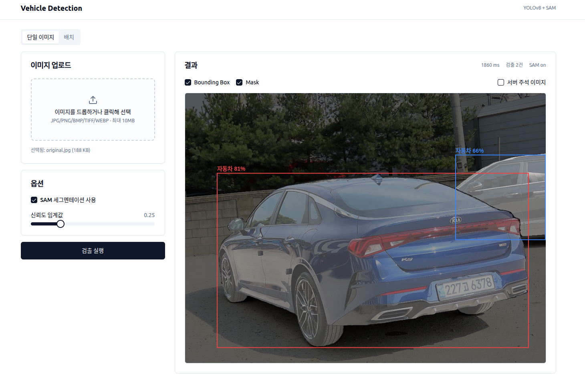

# Vehicle Detection & Segmentation

YOLOv8 + Meta SAM 기반 차량 감지/세그멘테이션 시스템. FastAPI 백엔드와 React 프론트엔드, 그리고 CLI를 제공합니다.



## 프로젝트 구조

```
vehicle-detection/
├── backend/                     # Python 백엔드
│   ├── api/                     # FastAPI 앱
│   │   ├── main.py              # 엔트리포인트 (lifespan, CORS, static mount)
│   │   ├── settings.py          # 런타임 설정 (TTL, 업로드 제한, CORS)
│   │   ├── deps.py              # 파이프라인 싱글턴 주입
│   │   ├── middleware.py        # X-Request-Id
│   │   ├── logging_config.py    # structlog 기반 로깅
│   │   ├── schemas.py           # Pydantic 응답 스키마
│   │   └── routers/
│   │       ├── detect.py        # POST /api/detect, /api/detect/batch
│   │       ├── jobs.py          # GET /api/jobs/{id} + TTL cleanup
│   │       └── meta.py          # GET /api/system/health, /api/models
│   ├── services/
│   │   └── detection_service.py # 순수 감지 로직 (재사용 계층)
│   ├── tests/                   # pytest (API, service, config, bbox)
│   ├── config.py                # 모델/감지/하드웨어 설정 상수
│   ├── pipeline.py              # VehicleDetectionPipeline (YOLO+SAM)
│   ├── yolo_detector.py
│   ├── sam_segmentor.py
│   ├── utils.py
│   ├── main.py                  # CLI 엔트리
│   ├── app.py                   # (deprecated) Streamlit 앱
│   ├── requirements.txt
│   ├── data/  image/  models/  output/
│   └── pytest.ini
├── frontend/                    # React 18 + Vite 5 + TS + Tailwind + shadcn
│   └── src/
│       ├── App.tsx              # 단일/배치 탭
│       ├── pages/               # SinglePage, BatchPage
│       ├── components/          # Dropzone, DetectionCanvas(Konva), 등
│       ├── api/                 # client.ts, hooks.ts, schema.ts (생성물)
│       └── lib/
├── LICENSE
└── README.md
```

모든 Python 명령은 `backend/`에서 실행하세요.

## 빠른 시작

### 1) 백엔드

```bash
cd backend
python -m venv venv && source venv/bin/activate   # Windows: venv\Scripts\activate
pip install -r requirements.txt
# (선택) SAM 사용 시:
# pip install git+https://github.com/facebookresearch/segment-anything.git

uvicorn api.main:app --reload --port 8000
```

- API 문서: http://localhost:8000/docs
- 정적 결과(주석 이미지/마스크): `GET /api/static/<run_id>/...`

### 2) 프론트엔드

```bash
cd frontend
npm install
npm run dev         # http://localhost:5173
```

Vite dev server가 `/api/*` 요청을 백엔드(`:8000`)로 프록시합니다.

### 3) OpenAPI 타입 재생성

백엔드가 실행 중일 때 프론트엔드 타입을 갱신합니다.

```bash
cd frontend
npm run gen:api     # src/api/schema.ts 덮어쓰기
```

## 주요 API

베이스: `http://localhost:8000/api`

| 메서드 | 경로 | 설명 |
|---|---|---|
| POST | `/detect` | 단일 이미지 감지 (동기, multipart). form: `file`, `use_sam`, `confidence` |
| POST | `/detect/batch` | 배치 감지 (202 + `job_id` 반환). form: `files[]`, `use_sam`, `confidence` |
| GET  | `/jobs/{job_id}` | 배치 작업 상태/진행률/결과 |
| GET  | `/system/health` | GPU/메모리/모델 로드 상태 |
| GET  | `/models` | 지원 YOLO/SAM 모델 목록 |
| GET  | `/static/{run_id}/...` | 결과 이미지, 마스크 PNG |

런타임 제한 (`backend/api/settings.py`):
- 업로드 최대 **10MB**, 배치 최대 **10장**
- 허용 확장자: `.jpg .jpeg .png .bmp .tiff .tif .webp`
- 결과/작업 TTL **1시간**, 5분 주기 cleanup
- CORS 허용 오리진: `http://localhost:5173`, `http://127.0.0.1:5173`
- SAM 기본 **ON** (요청별 `use_sam`로 오버라이드)

## CLI

```bash
cd backend
python main.py <image>              # YOLO 단독
python main.py <image> --sam        # YOLO + SAM
python main.py <dir> --batch        # 디렉토리 배치
python main.py --info               # 시스템/모델 상태
python main.py --benchmark          # 성능 벤치마크
```

주요 옵션: `-m/--model`(yolov8n~x), `-c/--confidence`, `--device {auto,cpu,cuda}`, `--sam-model {vit_h,vit_l,vit_b}`, `--no-gui`, `--show`, `--max-images`, `--pattern`.

## 파이썬 라이브러리 사용

```python
from pipeline import quick_vehicle_detection, full_vehicle_analysis

result = quick_vehicle_detection("car.jpg", confidence=0.25)
result = full_vehicle_analysis("car.jpg", save_result=True)
```

서비스 레이어 재사용:

```python
from pathlib import Path
from pipeline import VehicleDetectionPipeline
from services.detection_service import run_single_detection

pipeline = VehicleDetectionPipeline(enable_sam=True)
with open("car.jpg", "rb") as f:
    result = run_single_detection(f.read(), pipeline, Path("output/api_runs"))
print(result.run_id, len(result.detections), result.inference_ms)
```

## 감지 대상 클래스

COCO 기준: `car`(자동차), `motorcycle`(오토바이), `bus`(버스), `truck`(트럭), `bicycle`(자전거).

## 테스트

```bash
cd backend
pytest                 # tests/ 전체
pytest tests/test_api_detect.py -v
```

## 레거시 Streamlit (deprecated)

`backend/app.py`는 참고용으로만 남아 있으며 신규 기능은 FastAPI + React 쪽에만 추가됩니다. 다음 정리 단계에서 제거될 수 있습니다.

```bash
cd backend && streamlit run app.py   # http://localhost:8501
```

## 문제 해결

- **CUDA OOM**: `--device cpu` 또는 더 작은 모델(`yolov8n.pt`).
- **SAM import 에러**: `pip install git+https://github.com/facebookresearch/segment-anything.git` 후 모델 가중치를 `backend/models/`에 배치.
- **YOLO 가중치 다운로드 실패**: 네트워크 차단 시 수동 다운로드 후 `backend/`에 위치시키면 `ultralytics`가 캐시를 인식.
- **CORS 오류**: 프론트 포트가 5173이 아니면 `backend/api/settings.py::CORS_ORIGINS`에 추가.

## 라이선스

[LICENSE](./LICENSE) 참조.
