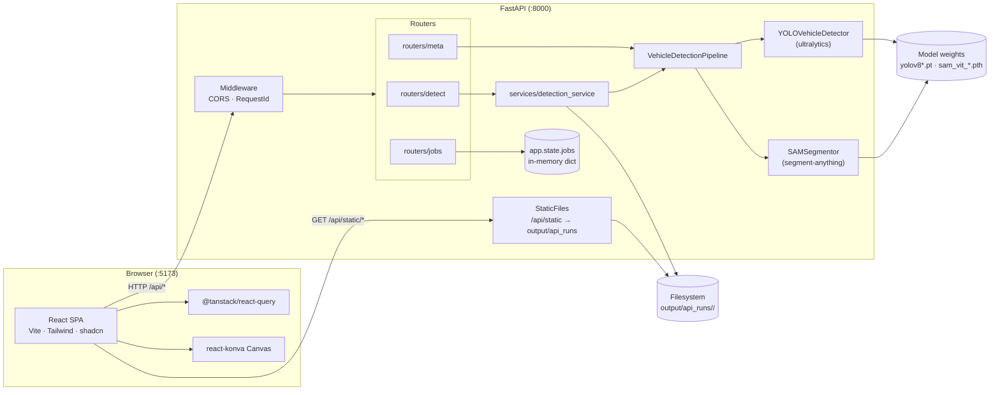
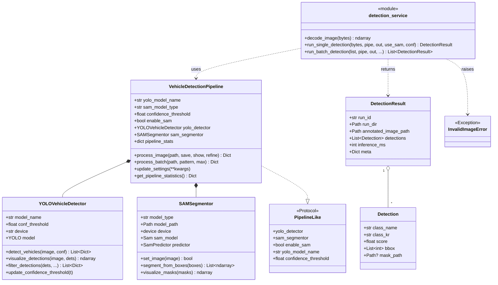
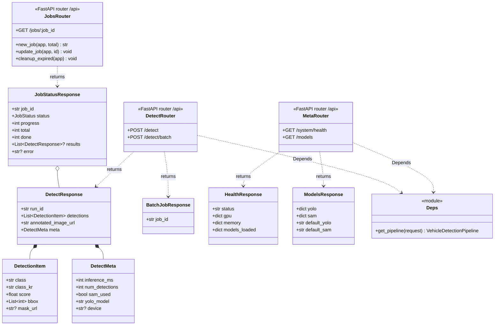
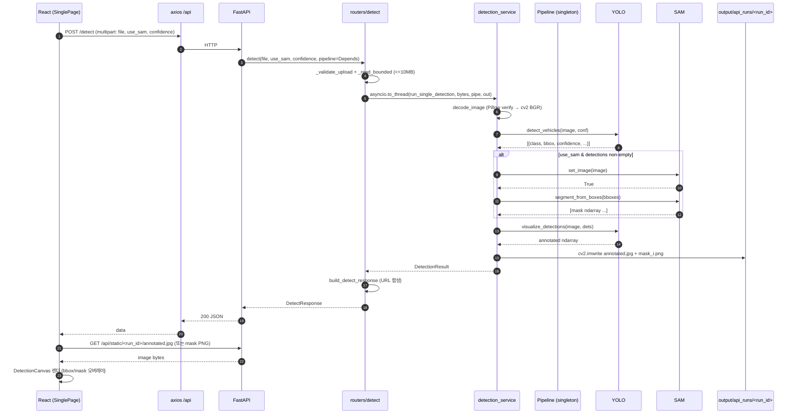
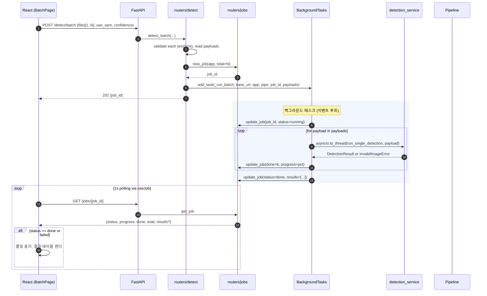
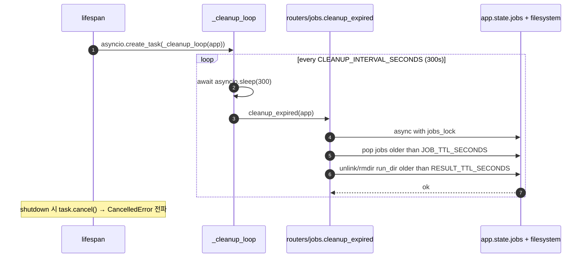
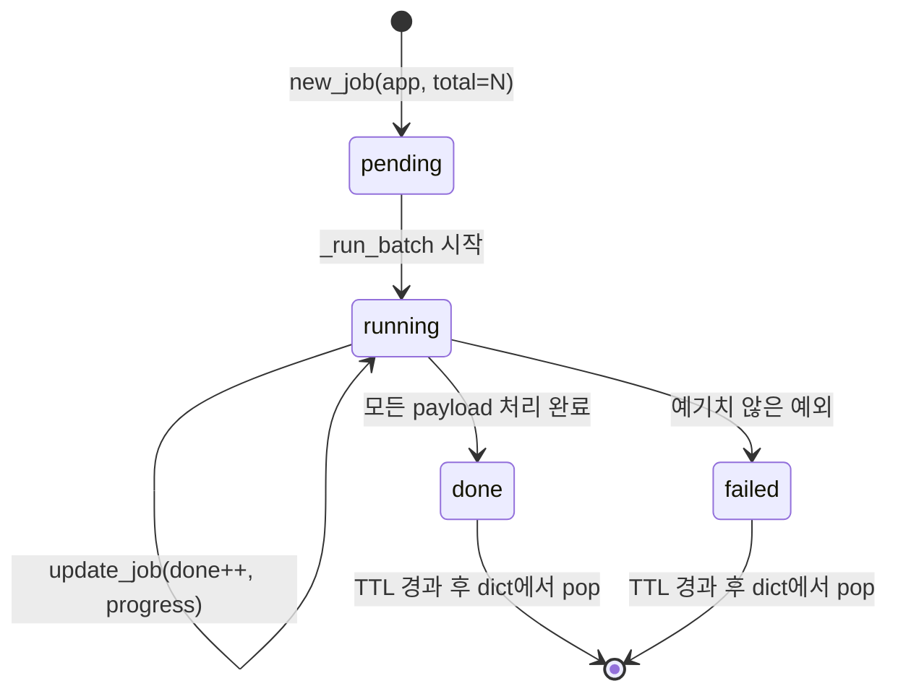
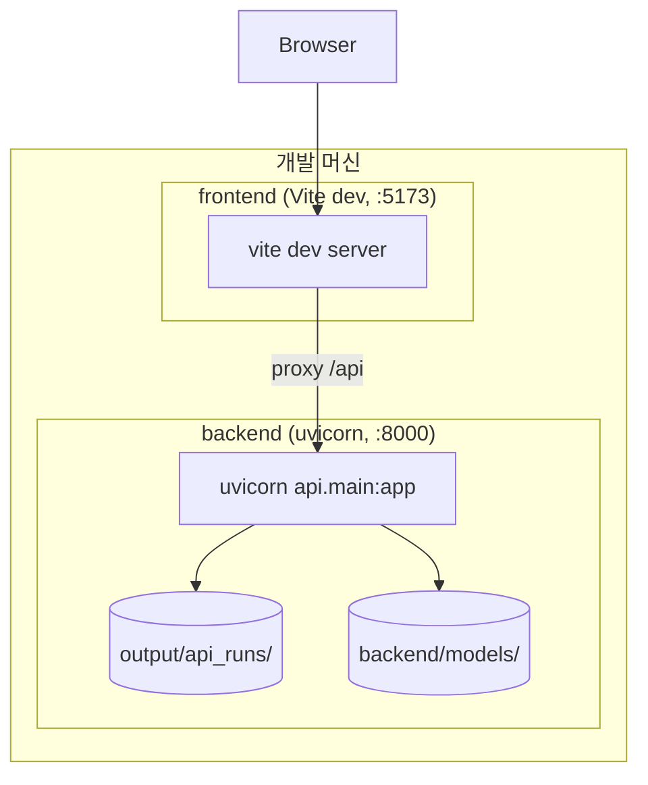
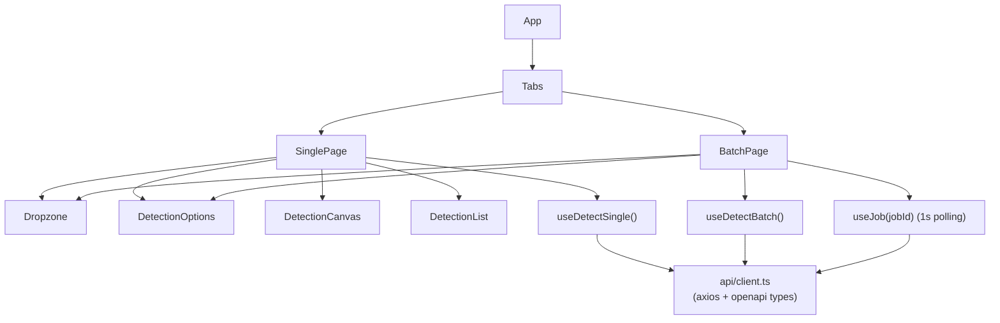

# UML Diagrams

Mermaid 기반 UML 스니펫 모음입니다. GitHub/VS Code/IntelliJ Markdown 미리보기에서 바로 렌더됩니다. 상위 구조는 [architecture.md](./architecture.md) 참조.

## 1. Component Diagram

시스템 상위 구성요소와 경계를 나타냅니다.

## 2. Class Diagram — 백엔드 핵심

서비스/도메인 계층의 주요 타입과 관계.

## 3. Class Diagram — API 스키마 / 라우터

Pydantic 응답 모델과 라우터 의존성.

## 4. Sequence — 단일 감지 (동기)

## 5. Sequence — 배치 감지 (비동기 job)

## 6. Sequence — TTL cleanup 루프

## 7. State — Batch Job 상태 머신

> 개별 이미지의 `InvalidImageError`는 job을 `failed`로 전이시키지 않고, 해당 슬롯에 `{"error": "..."}` 객체로 기록된 뒤 계속 진행.

## 8. Deployment (논리 뷰)

프로덕션에서는 Vite 빌드 결과(`frontend/dist`)를 CDN 혹은 FastAPI `StaticFiles`로 서빙하고, uvicorn은 gunicorn/uvicorn-worker 뒤에 배치하는 형태로 확장 가능합니다.

## 9. 프론트엔드 컴포넌트 (요약)

